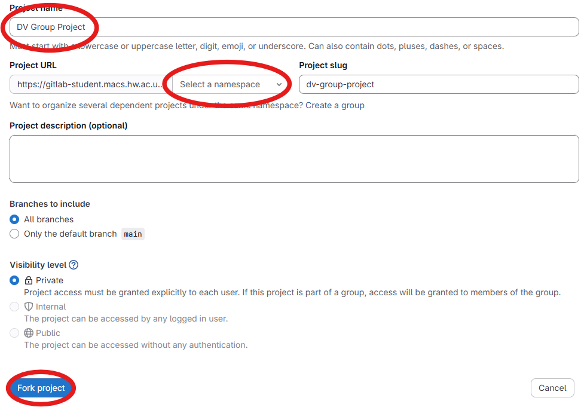
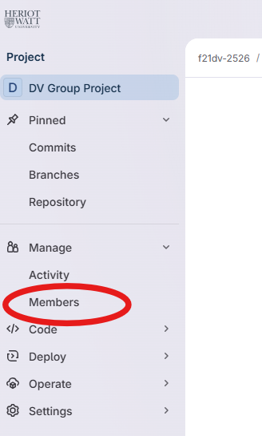
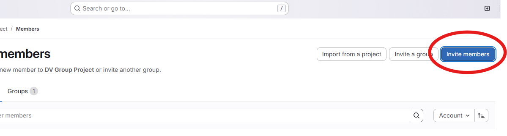
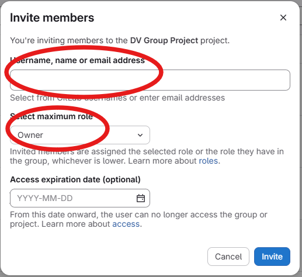

This is the repository for the the Data Visualisation & Analytics course group project.

You must work from this template on GitLab.

Remember that we will adjust your individual grade based on your contributions on this repository.

### TODO

 - [ ] One member of the group (e.g., designated group leader), must fork the project template (see screenshot below).
    - Move the project under your namespace (e.g., `abc1234`)
    - Rename the project name with to include: your cohort (_F21DV_ or _F20DV_), your campus (_DU_, _ED_, _MY_), and your group number. For example:
        - F21DV DU Group 8
        - F20DV MY Group 2
        - F21DV ED Group 11

 - [ ] That same group member then invites other group members to the project (see screenshots below).
    - Open the members' panel, from the link on the side bar
    - Click on _Invite members_
    - In the modal, enter your group members' username, make sure to add them with the _Owner_ permissions.
    - Click _Invite_
    - Lecturers and TAs should already part of the forked project. 

 - [ ] Every group member can clone the repository to work on the project.
 - [ ] After cloning (for every new machine you sue) make sure that your username and email are set correctly.
    - `git config user.name "Firstname Lastname"`
    - `git config user.email "abc1234@hw.ac.uk"`
    - If other deatils are used (e.g., global GitHub config), we might not be able to tell who is who, and therefore who should get marks.

Unless you know how to work with those already, we recommend you do not use branches. If your commits history gets lost with a bad merge, we might not be able to see it.